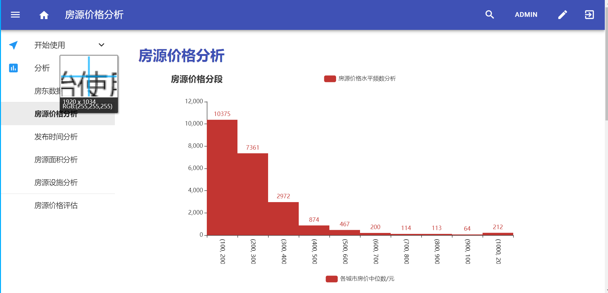

# 美团民宿房源分析
 
此项目包括网络爬虫和基本的数据可视化展示工作，主要使用了Scrapy和Django，可视化部分则使用了Pyecharts ,matplotlib 等来进行实现。前台为可视化展示模块，后台为管理员数据管理模块。

欢迎大家交流使用，如果觉得对你有帮助，可以点个赞😘


## 这个就是一个Django+ scrapy结合的模板


scrapy使用djangoItem 库，来使用django的models。这样就可以使用scrapy将爬取到的数据通过django orm框架，然后在admin中可以直接显示出来。这样就可以很方便的统一数据库，并且因为使用了orm来操作，scrapy保存的时候更为方便，就是配置的时候麻烦点，故把合并后的模板放在这儿，😂功能就是合并好后方便以后结合这两个继续开发新的东西做准备

## 大概的配置步骤


项目的目录如下：

```python
Scrapy-django
├───mydjango(django项目)
│   │   manage.py
│   ├───myapp
│   │
│   └───mydjango
└───myscrapy（scrapy项目）
    │   scrapy.cfg
    │   
    └───myscrapy
        ├───spiders
        │   meiju.py
        │__init__.py
```


+ 创建好Django项目
  + 配置好mysql连接和创建好superuser
  + 创建好一个对应的app来使用它的models来建表
  + python manage.py makemigrations myapp
  + python manage.py migrate 
  + python manage.py runserver
+ 创建好可用的scrapy项目，然后配置settings
  + pip install scrapy-djangoitem
  + settings 按要求设置好django目录
  + items.py 中导入django models中的模型，用scrapy-djangoitem来继承
  + 然后在spiders中调用item来储存
  + 配置好管道并且开启item.save()即可

# 本模板环境依赖参考

django 2.0

scrapy 1.7.3

mysql 5.7

scrapy_djangoitem

等，如果遇到提示说要安装再pip install 即可


# 结果示范



# todo

两个部分来进行工作：

DJango部分：

1.增加更多数据挖掘算法相关的功能，或者对数据进行建模，进一步分析。

Scrapy部分：

1.写好脚本每日定时检查爬虫运行状态，如果停止就重新启动
2.增加更好增加城市范围的设定，方便调整抓取的范围
3.反爬研究...
